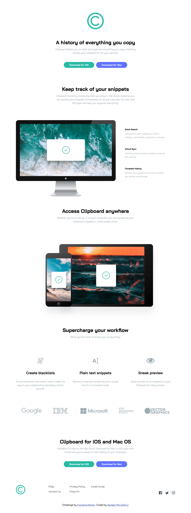

# Frontend Mentor - Clipboard landing page solution

This is a solution to the [Clipboard landing page challenge on Frontend Mentor](https://www.frontendmentor.io/challenges/clipboard-landing-page-5cc9bccd6c4c91111378ecb9). Frontend Mentor challenges help you improve your coding skills by building realistic projects. 

## Table of contents

- [Overview](#overview)
  - [The challenge](#the-challenge)
  - [Screenshot](#screenshot)
  - [Links](#links)
- [My process](#my-process)
  - [Built with](#built-with)
  - [What I learned](#what-i-learned)
  - [Continued development](#continued-development)
- [Author](#author)

## Overview

### The challenge

Users should be able to:

- View the optimal layout for the site depending on their device's screen size
- See hover states for all interactive elements on the page

### Screenshot

### Links

- Solution URL: [Add solution URL here](https://github.com/palaogluserdest/clipboard-landing-page)
- Live Site URL: [Add live site URL here](https://clipboard-landing-page-flex.netlify.app/)

## My process

### Built with

- Semantic HTML5 markup
- SCSS
- Flexbox

### What I learned

I tried to make a simple project by separating it into components with scss structure. I tried to use flex structure. Since I do not know the responsive part of the scss structure yet, I did not include it for this project.

### Continued development

When I learn some of the responsive design in the scss structure, I will update it.

## Author

- Frontend Mentor - [@yourusername](https://www.frontendmentor.io/profile/palaogluserdest)

